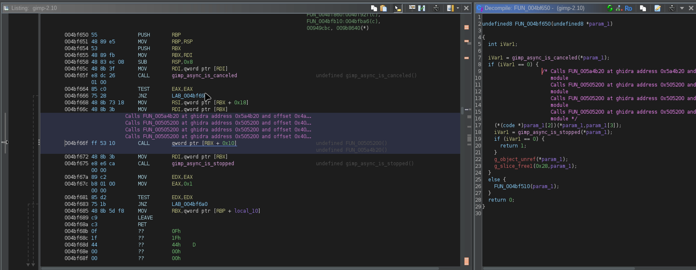
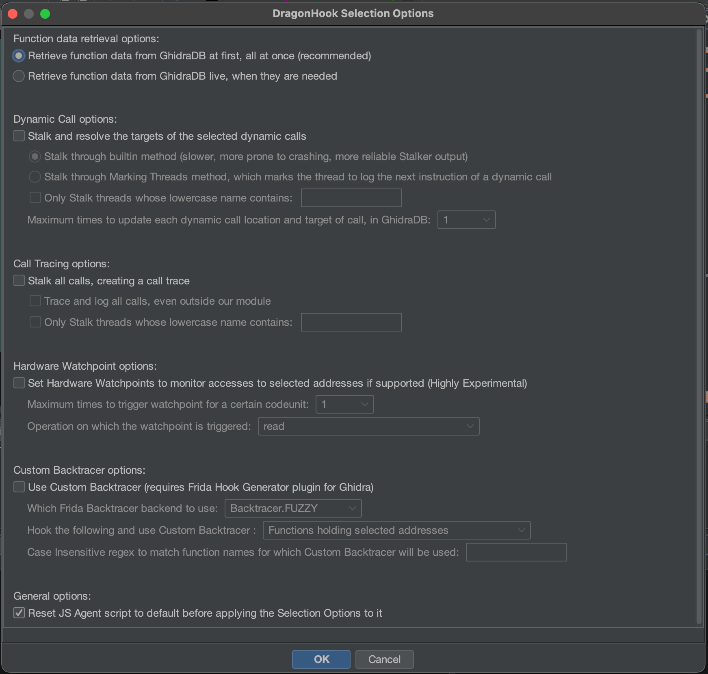

## DragonHook

DragonHook is a Ghidra plugin that tries to integrate the information inside the GhidraDB with the dynamic capabilities of Frida.  
On the one hand, it exposes several useful functionalities of the GhidraDB (such as querying information on functions, updating with comments and dynamically inferenced references etc). This is ultimately available to Frida, live, through JavaScript function calls.  
On the other hand, it provides a handy interface to easily invoke Frida with a couple of clicks, so that the interaction with the GhidraDB is seamless.  

An example video which showcases how dynamic call targets can be resolved live and updated inside GhidraDB is provided [in this link](https://youtu.be/lmWZHO_q5VI).  
The result of the dynamic call resolution is an update with a comment and an xref, inside the GhidraDB:



The main use cases, as supported at the moment, are the following:

- Stalk and calculate at runtime the targets of the dynamic calls (CALLs to a register), and update the GhidraDB with that information, live and as the CALLs are performed. A comment and an xref is added.
- Provide a custom backtracer that prints the backtrace string using the functions as they are known to Ghidra.
- Stalk and create a trace of called functions, not by using offsets from the start of the module, but actual function names as they are known from GhidraDB.
- (Experimental) Leverage the Hardware Watchpoint functionality (when available) to monitor which parts of the code alter a certain memory address, and update GhidraDB with the relevant comment + xref.

#### Installation:

- Take the latest ghidra\_\<version\>\_PUBLIC\_\<date\>\_DragonHook\_\<dragonhookversion\>.zip file which is inside the folder dist/ . Alternatively, grab the latest `gradle` version from [here](https://gradle.org/releases/), the latest `Ghidra` version from [here](https://github.com/NationalSecurityAgency/ghidra/releases), start Ghidra for the first time to perform initializations, cd into the root directory of the project and run
```
/path/to/gradle -PGHIDRA_INSTALL_DIR=/path/to/ghidra
```
which will produce a .zip file to be installed inside the dist/ folder.
- From Ghidra (before opening a tool) -> File -> Install Extensions -> + sign -> Select the zip -> Make sure the DragonHookPlugin is checked in the list of extensions
- Restart Ghidra
- Open CodeBrowser tool and analyze a binary. When asked if the new plugin should be configured, press "Yes" and make sure it is ticked. 


#### Dependencies:

```
pip install frida requests
```

#### Basic Workflow:

- Open CodeBrowser tool and analyze a binary. If it is the first time after the installation, you will be asked if the new plugin should be configured. Press "Yes" and make sure it is ticked. 
- IMPORTANT: Right click at the Listing Window on an address and select "DragonHook Config..." -> "Start HTTP server". The plugin will not work without enabling the server.
- Right click at the Listing Window on an address and select "DragonHook Config..." -> "Edit config..." . This will open the default editor for JSON files, through which some options on how to invoke Frida can be configured.
- Select a few addresses, right click, and then select "DragonHook Selection". This will spawn a menu with the various options for the selected addresses, select the ones that are needed and click "OK".
- Right click, and select "DragonHook Run Agent!". This should invoke a python script that will launch Frida with the predefined options.

The configuration options can be seen under the section "Configuration Options", and the spawned menu offers the following functionalities:



#### Example Workflow:

In this case, let's assume that we want to resolve all the dynamic calls of the analyzed binary in Ghidra, for the first 5 times that they are called. The workflow is the following, and can be observed visually [in this video](https://youtu.be/lmWZHO_q5VI).
- Right click ->  DragonHook Config... -> Start HTTP server
- Right click ->  DragonHook Config... -> Edit config ...  . This will spawn an editor through which we can alter the configuration options, as described in section "Configuration Options".
- Ctrl-A to select all the addresses in the Listing Window.
- Right click, DragonHook Selection .... . A dialog will spawn.
- We select the "Stalk and resolve the targets of the selected dynamic calls", and set the number of times to update the GhidraDB for each call, to 5.
- After pressing "OK", the plugin will go over all selected addresses and extract the addresses of the dynamic calls, and then update the JavaScript Agent file with them. If fewer addresses were selected, dynamic calls would only be extracted from the selection.
- The Agent file, before Frida is invoked, can be observed and edited from Right click ->  DragonHook Config... -> Edit agent script... .  It is a large JavaScript file, containing the full functionality for the necessary DragonHook interactions.  At the end, inside the function `intercept_identified_module_DragonHook()`, the user code is typically placed.


#### Architecture:

Ghidra spawns an HTTP server at localhost:8124 by default. When the Agent is run, a python process is created that launches Frida with the predefined options. At any time Frida wants to read or write to the GhidraDB, it sends the related information to python which queries the HTTP API. Then, the result is returned back to Frida.  
The python script can be altered with a right click ->  DragonHook Config... -> Edit python invoker script.  
The configuration file is a JSON that can be altered with a right click ->  DragonHook Config... -> Edit config.  
The JavaScript file that is run by Frida is the Agent, and it can be altered with a right click ->  DragonHook Config... -> Edit agent script.  
In all the three cases, these files are opened with the default editor as configured in the OS.  
The application also redirects the standard output / standard error in specific files, whose locations are printed in the Console Window (they vary by Operating System).  


#### Configuration Options:

The Configuration Options (accessible from Right click ->  DragonHook Config... -> Edit config) are a JSON file that looks like the following:

```
{
    "SPAWN_PROCESS_FROM_FRIDA":true,
    "PATH_OF_PROCESS_TO_HOOK":"/usr/bin/gimp-2.10",
    "PID_OF_PROCESS_TO_ATTACH":"",
    "DEVICE_ID_OF_DEVICE_TO_ATTACH_TO":"LOCAL",
    "PATH_OF_PYTHON_BINARY":"python3",
    "GHIDRA_HTTP_SERVER_INTERFACE_IP":"127.0.0.1",
    "GHIDRA_HTTP_SERVER_PORT":"8124",
    "DOS_LIMIT_PER_AGENT_RUN_ALLOWED_CALLS_FOR_FUN_DATA_GIVEN_ADDR_OFFSET":"15",
    "DOS_LIMIT_PER_AGENT_RUN_ALLOWED_CALLS_FOR_ALL_FUN_DATA_SORTED_BY_RANGESTART":"15",
    "DOS_LIMIT_PER_AGENT_RUN_MAX_COMMENTS_TO_BE_SET_PER_CODEUNIT":"15",
    "DOS_LIMIT_PER_AGENT_RUN_MAX_XREFS_TO_BE_SET_PER_CODEUNIT":"15",
    "DOS_LIMIT_PER_AGENT_RUN_ALLOWED_CALLS_FOR_CODEUNIT_DATA_GIVEN_ADDR_OFFSET":"10",
    "DOS_LIMIT_PER_AGENT_RUN_ALLOWED_CALLS_FOR_CHANGE_BYTES_INSIDE_GHIDRADB":"0"
}
```

Some comments on them:
- SPAWN_PROCESS_FROM_FRIDA is mostly self-explanatory. If it is set to true, PID_OF_PROCESS_TO_ATTACH is ignored.
- PATH_OF_PROCESS_TO_HOOK is only used when SPAWN_PROCESS_FROM_FRIDA is true. In case of a mobile application, provide its name because it will effectively be passed to Frida's "-f" parameter.
- PID_OF_PROCESS_TO_ATTACH is only used when SPAWN_PROCESS_FROM_FRIDA is false. A string value is accepted, it is later converted to integer.
- DEVICE_ID_OF_DEVICE_TO_ATTACH_TO: The standard accepted values are "LOCAL", "USB" or "REMOTE\-\<IP\>\-\<PORT\>" (the default Frida Server port is 27042). For any other type of value, the entry is treated as a device ID and frida.get_device() is called on it.
- PATH_OF_PYTHON_BINARY: The full path may be required, especially on Windows.
- The DOS-related values affect the way Ghidra serves the various API endpoints. This is because the binary instrumented by Frida should be considered malicious, and can exhaust the server's resources. The configured Frida script also generally avoids to make redundant API calls, but these DOS values affect the Ghidra HTTP server.


#### Notes

This is a plugin with a lot of moving parts. In case a bug is found, please report it through the Issues. However, unless the bug is in the Java part of the Ghidra backend, you may also be able to fix it yourself so that your workflow is not interrupted. Typically, the bug will be on the Agent file, edited from right clicking ->  DragonHook Config... -> Edit agent script. It is useful to consult the stdout/stderr files (their locations are printed in the Ghidra Console window) because they may point to what the error is.
